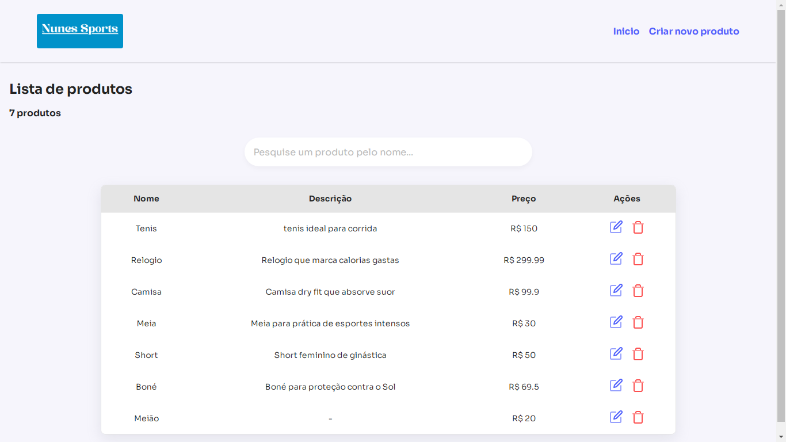
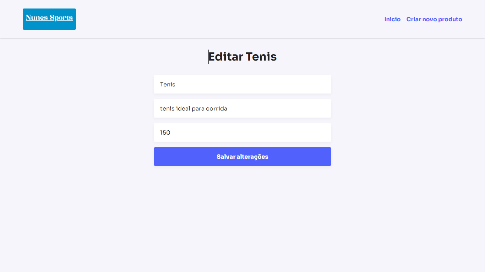
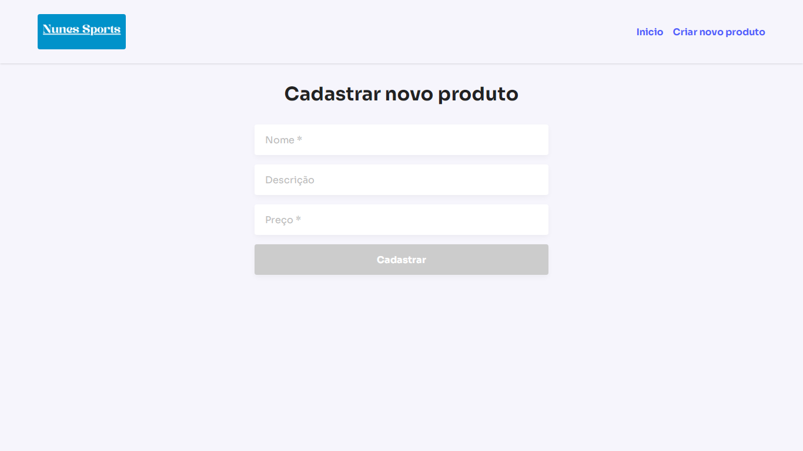

# Nunes Sports - frontend

Projeto que mostra os produtos de uma loja em uma tabela, para visualização, edição e criação de produtos vendidos pela loja.

<h2 id="layout">🎨 Layout</h2>

<p align="center">
    
    
    
</p>

<h2 id="tecnologias">💻 Tecnologias</h2>

- react
- styled components
- vite
- axios

<h2 id="started">Como rodar o projeto</h2>

- Ter nodejs installado.
- Abrir o terminal na pasta do projeto e rodar o comando "npm install".
- [Estar com o backend rodando](https://github.com/vinicius-mendes07/nunes-sports-backend)
- Criar um arquivo .env com o valor:
  ```
  VITE_PUBLIC_BASEURL=http://localhost:3000
  ```
  - OBS: Caso o backend esteja rodando em uma porta diferente da 3000, substitua o valor acima pelo da porta do backend.
- Rodar o comando "npm run dev".
